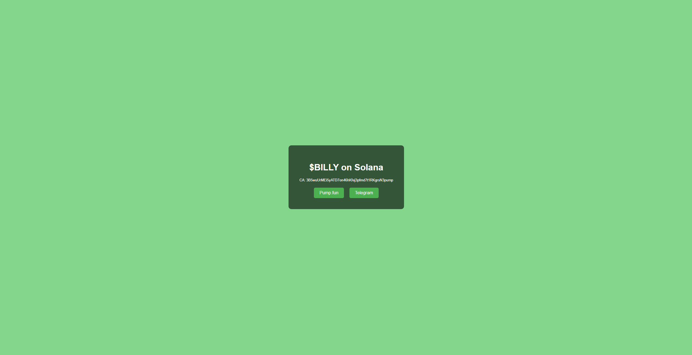
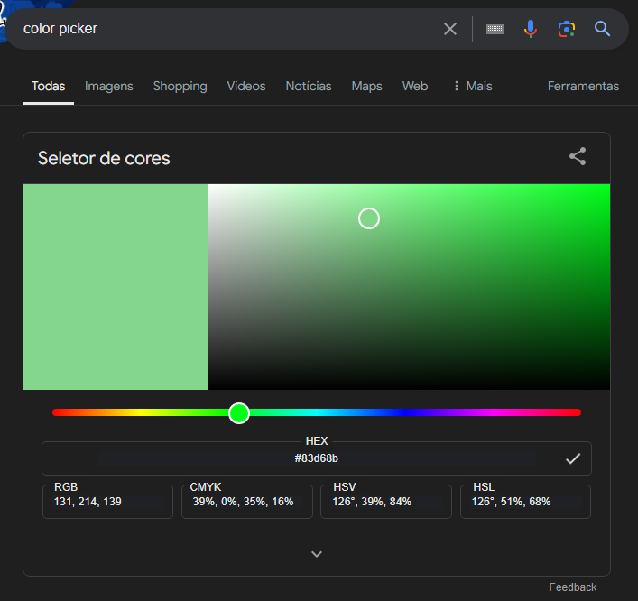

# Cryptocurrency Info Page Generator

  

This program generates simple HTML pages that gather information about cryptocurrencies. The generated HTML page includes the cryptocurrency name, contract address (CA), and links to a Telegram group and a pump.fun page.
For this program to work its extremely important that you have both Python and pip (Package installer for python) installed in your machine, so if you don't have, please refer to [this link](https://realpython.com/installing-python/) .

Also, this is a base version and you can absolutely change the code structure to fit your needs. (lmao there's almost no code, its just plain HTML 😭)

## Features

  

- Customizable background color.

- Responsive and centered layout.

- Background text effect with repeated cryptocurrency name. (NOT WORKING COMPLETELY, I STILL HAVE TO FIGURE THIS OUT CORRECTLY)

  

## Requirements

  

- Python 3.x

- Jinja2

  

## Installation

  

1. Clone the repository:

```bash

git clone https://github.com/23f09crz/crypto-info-page-generator.git

cd crypto-info-page-generator

```

  

2. Install the required Python packages:

```bash

pip install -r requirements.txt

```

  

## Usage

  

1. Run the script:

```bash

python main.py

```

  

2. Follow the prompts to enter the cryptocurrency information:

```text

Write the name of the cryptocurrency: Bitcoin

Write the CA of the cryptocurrency: 1A1zP1eP5QGefi2DMPTfTL5SLmv7DivfNa

Paste the telegram link of the cryptocurrency: https://t.me/bitcoin

Enter the background color (e.g., #f4f4f4 or lightblue): #000000

```

  

3. The HTML page will be generated and saved in the `templates` folder with the name `<cryptocurrency_name>.html`.

  

## Example

  

Here is an example of the prompts and their corresponding inputs:

  

```text

Write the name of the cryptocurrency: $BILLY

Write the CA of the cryptocurrency: 3B5wuUrMEi5yATD7on46hKfej3pfmd7t1RKgrsN3pump

Paste the telegram link of the cryptocurrency: https://t.me/BILLY

Enter the background color (e.g., #f4f4f4 or lightblue): #83d68b
```

Then, the HTML file "$BILLY.html" will be created in the templates directory, here's an example:


## FAQ-ish
- Do I have to choose the color using hexcode?
 Not necessarily, but there is no reason to not use it. You can choose exactly the type of color you want using hexcode, and that is much better than just sticking with "lightblue".  Also, getting the hexcode for a color is very easy, you can just google "color picker" and let it do the rest:

 
 - How do I put my page on the web?
 There are various ways to deploy your page online, there are free website hosting alternatives like vercel that will suit well a simple page like that.

 
